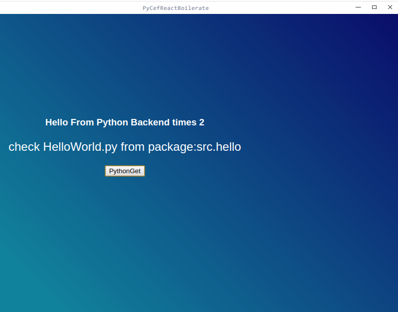

## PyCef-React-Boilerplate
use cefpython and React tools for desktop environment    
[中文文档](./README-CN.md)    


<div align="center">
  <a></a>
</div>
  
  
web part forked [electron-react-boilerplate:https://github.com/chentsulin/electron-react-boilerplate]   
python part inspired by [cefpython:https://github.com/cztomczak/cefpython]

### Why Not User Electron
Simple: Who want to use python as backend server logic not nodejs.
Nodejs as backend language is so fucked to use

### First Know
Not finish(Package and Tools Part)
Require Tools:
npm yarn pip python


### FrameWork
```html
   conf--
      webpack-> webpack package configuration
   web---
        render->
           components-> react components
           containers-> react page
           models->mbox
        template-> 
           app.html -> page template
   src---
      backend---(use web)  
         hello.py 
      framework---   
         libs --- include some tools for js system default provide
         qt --- include qt tools and framework    
         installer --include installer tools
         shell-- pyinstaller shell:
   resources---
      icon---
      static---
   pip.conf 
   package.json  
   boiler.py --the build tools
   babel.config.js --babel settings
   
```

### Usage
   start the package you should run
   
   check:check the tools you should install
   ```bash
   ./boilder.py check
   ```
   
   build: install the dependencies by tyarn and pip.Please Check the requirements.txt and package.json file
   add the dependencies 
   ```build
   ./boilder.py build
   ```
   
   run: run the application
   ```run the debug
    ./boilder.py run 
   ```
   
   run-debug: run the application in debug mode
   ```

   ```
   
### Usage:Code
   python backend code please check the src.backend.hello file。    
   front web code please check web index.js.I use the mbox + react. check it   
   
   backend like
   ```python
     class HelloWorld(ModuleBase):
         def __init__(self):
            self.times = 0

         @ToBindMethod
         def hello(self):
            self.times = self.times + 1
            return "Hello From Python Backend times " + str(self.times)
   ```
   
   javascript invoke like
   ```javascript
    function fetchHello(){
      window.HelloWorld.hello((result)=>{console.log("result")})
    }
   ```
 the class translate to Module  and method to translate method
   
### for XP

